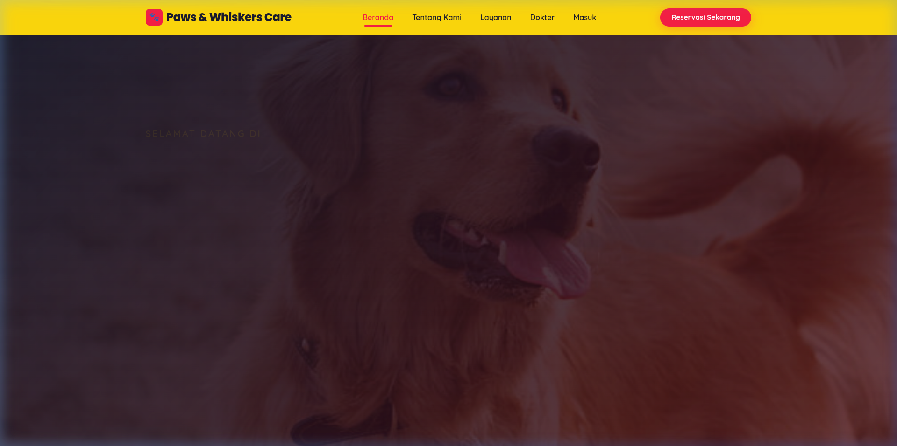
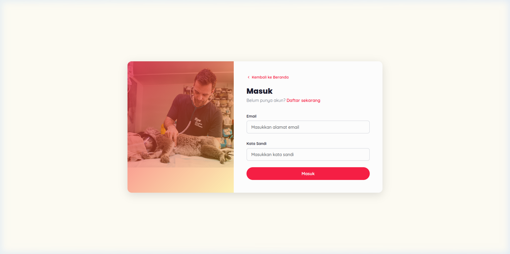
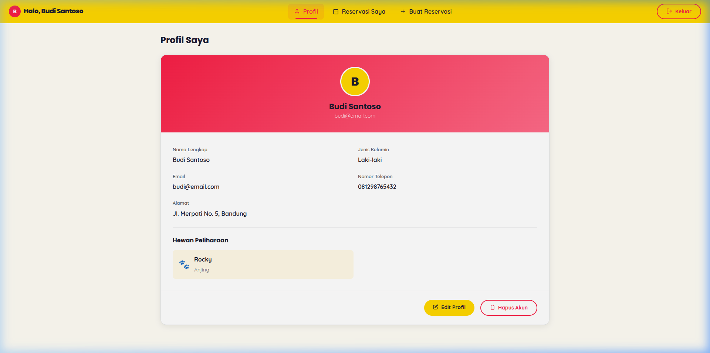
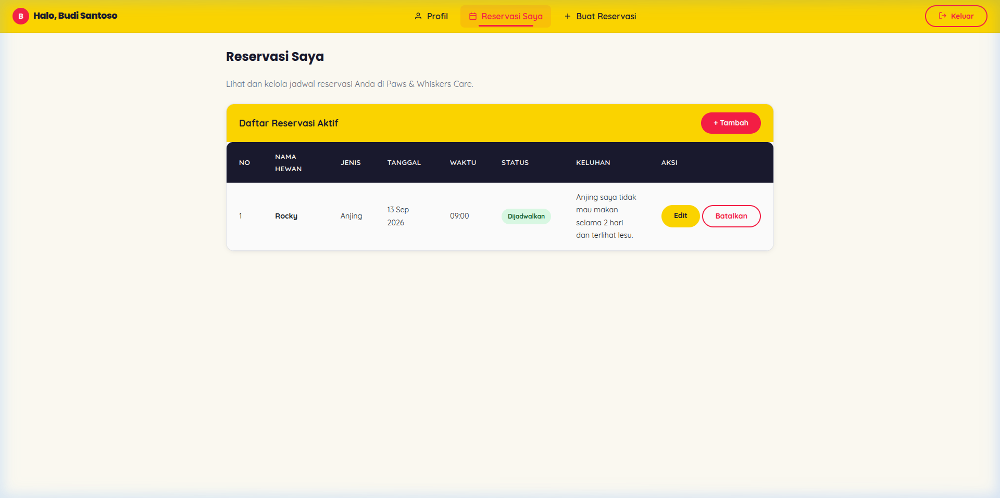
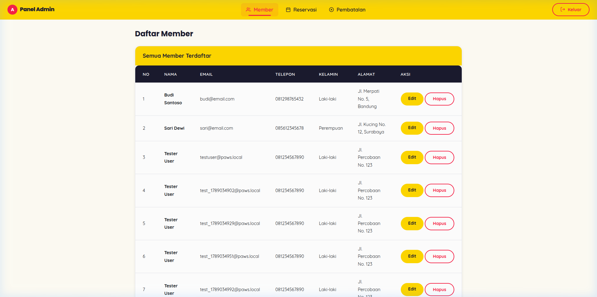

# 🐾 Paws & Whiskers Care

> **Veterinary Clinic Management & Appointment Booking System**  
> Sistem Reservasi Janji Temu & Manajemen Klinik Dokter Hewan Berbasis Web (Full-Stack PHP, MariaDB, Docker & Modern CSS).

---


---

## 📌 Ringkasan Proyek

**Paws & Whiskers Care** adalah aplikasi web lengkap untuk layanan klinik hewan peliharaan. Aplikasi ini memfasilitasi pemilik hewan untuk menjadwalkan konsultasi dokter, melacak riwayat janji temu, dan mengelola profil hewan kesayangan mereka secara real-time. Dilengkapi pula dengan **Panel Admin** terpusat untuk memantau antrean reservasi, mengonfirmasi permintaan pembatalan, dan mengelola data keanggotaan klinik.

Proyek ini telah dikembangkan ulang dari basis kode lama dengan mengedepankan **Software Engineering Best Practices**:
- **Security-First**: Bebas SQL Injection (PDO Prepared Statements), Password Hashing standar industri (`password_hash` & `password_verify`), Proteksi XSS (`htmlspecialchars`), serta proteksi sesi berbasis peran (**Role-Based Access Control / RBAC**).
- **Modern UI/UX**: Palet warna hangat (*Warm Rose*, *Golden Amber*, *Deep Navy*), tipografi tajam, navigasi responsif, kartu informasi interaktif, dan status badge dinamis.
- **Dockerized Architecture**: Siap dijalankan di lingkungan manapun hanya dengan satu baris perintah tanpa ketergantungan instalasi XAMPP lokal.
- **100% Offline-Ready**: Seluruh library CSS & JS (Bootstrap 5.3.3) dibundel secara lokal di repository untuk menjamin keandalan tanpa risiko CDN downtime.

---

## 📸 Tangkapan Layar (Screenshots)

### 1. Halaman Beranda (Landing Page)
Tampilan awal interaktif dengan hero section memikat, navigasi mulus, kartu layanan klinik, dan profil dokter hewan berpengalaman.


---

### 2. Autentikasi Pengguna (Login & Register)
Form login & pendaftaran terpisah dengan validasi sisi klien & server, umpan balik kesalahan yang jelas, dan enkripsi kata sandi.


---

### 3. Dashboard Profil Pengguna (Member Area)
Menampilkan avatar inisial otomatis, data diri lengkap, serta daftar ringkasan hewan peliharaan terdaftar.


---

### 4. Manajemen Reservasi & Jadwal Janji Temu
Tabel interaktif untuk memantau status janji temu (`Dijadwalkan`, `Diubah`, `Dibatalkan`), fitur edit jadwal, dan pengajuan pembatalan reservasi.


---

### 5. Panel Administrator
Area kontrol khusus staf/dokter klinik untuk mengelola seluruh akun pelanggan, memantau kuota jadwal konsultasi, dan mengeksekusi persetujuan pembatalan.


---

## 🚀 Fitur Utama

### 👤 Pengguna Publik & Member
- 🐾 **Katalog Dokter & Layanan**: Informasi profil dokter hewan, keahlian medis, dan deskripsi spesialisasi.
- 📅 **Reservasi Fleksibel**: Form reservasi multi-langkah (pilihan dokter, jenis peliharaan, tanggal, serta slot jam kunjungan dengan deteksi kuota otomatis).
- ✏️ **Manajemen Janji Temu**: Pengguna dapat memperbarui rincian janji temu atau mengajukan pembatalan jika berhalangan hadir.
- 🐕 **Manajemen Peliharaan**: Riwayat hewan peliharaan pengguna langsung tersimpan pada profil akun.

### 🛡️ Administrator
- 👥 **Kelola Member**: Tinjau, perbarui, atau hapus keanggotaan pengguna.
- 📋 **Sentralisasi Reservasi**: Pantau seluruh antrean jadwal konsultasi klinik secara komprehensif.
- 🔄 **Antrean Konfirmasi Pembatalan**: Validasi permohonan pembatalan dari member untuk memperbarui jadwal dokter terkait.

### 🔒 Keamanan & Performa
- **PDO & Prepared Statements**: Parameter SQL sepenuhnya terisolasi dari kueri mentah.
- **Bcrypt Password Security**: Penyimpanan kata sandi aman dengan salt otomatis.
- **Strict RBAC**: Isolasi ketat antara hak akses Administrator dan Pengguna biasa.
- **Dry & Clean Architecture**: Menghilangkan duplikasi kode database melalui kelas sentral `Database`.

---

## ⚡ Panduan Instalasi & Menjalankan

### Cara 1: Menggunakan Docker (Sangat Direkomendasikan ⭐)

Tidak memerlukan instalasi XAMPP, Apache, atau MySQL manual di komputer Anda.

1. **Clone repository ini**:
   ```bash
   git clone https://github.com/username/paws-whiskers-care.git
   cd paws-whiskers-care
   ```

2. **Jalankan dengan Docker Compose**:
   ```bash
   docker compose up -d
   ```

3. **Buka aplikasi di browser**:
   - Web App: [http://localhost:8080](http://localhost:8080)
   - MariaDB Port: `localhost:3306`

4. **Menghentikan aplikasi**:
   ```bash
   docker compose down
   ```

---

### Cara 2: Menjalankan Secara Manual (XAMPP / Server Lokal)

1. Pindahkan folder proyek ke direktori `htdocs` XAMPP Anda.
2. Nyalakan service **Apache** dan **MySQL** dari XAMPP Control Panel.
3. Buka **phpMyAdmin** ([http://localhost/phpmyadmin](http://localhost/phpmyadmin)).
4. Impor file SQL yang tersedia pada `Database/schema.sql`.
5. Sesuaikan konfigurasi host/user/password database pada [Database/config.php](Database/config.php) jika diperlukan.
6. Akses proyek via browser di `http://localhost/paws-whiskers-care`.

---

## 🔑 Akun Uji Coba (Demo Credentials)

Untuk kenyamanan eksplorasi portofolio, database awal telah dilengkapi dengan akun siap pakai:

| Peran Akun | Alamat Email | Kata Sandi | Halaman Utama |
| :--- | :--- | :--- | :--- |
| **Administrator** | `admin@pawswhiskers.com` | `password` | `/Admin/data_member.php` |
| **Member 1** | `budi@email.com` | `password` | `/Profil/profil.php` |
| **Member 2** | `sari@email.com` | `password` | `/Profil/profil.php` |

*(Pengguna juga dapat mendaftarkan akun baru melalui halaman pendaftaran `Auth/signIn.php`)*

---

## 📂 Struktur Direktori

```text
tugas_uas_web/
├── Admin/                 # Halaman & view panel administrator
│   ├── dashboard_admin.php
│   ├── data_member.php
│   ├── data_reservasi.php
│   └── data_konfirmasi_hapus.php
├── Assets/                # Aset statis pendukung antarmuka
│   ├── Images/            # Ilustrasi, foto dokter, dan background
│   ├── Style/             # CSS kustom (style.css terpadu)
│   └── vendor/            # Vendor lokal (Bootstrap 5.3.3 CSS & JS)
├── Auth/                  # Modul login, registrasi, logout, & validasi
├── Database/              # Skrip abstraksi PDO, skema database, & handlers
│   ├── config.php         # Koneksi DB PDO & repository method
│   └── schema.sql         # DDL tabel & seed data awal
├── Profil/                # Modul area member, profil, & form reservasi
├── docs/                  # Dokumentasi & aset gambar pendukung README
│   └── screenshots/
├── docker-compose.yml     # Konfigurasi multi-container (Web & MariaDB)
├── Dockerfile             # Definisi environment PHP 8.3 Apache
└── index.html             # Landing page utama
```

---

## 🛠️ Tech Stack

- **Backend**: PHP 8.3 (Native OOP with PDO)
- **Database**: MariaDB 10.11 / MySQL 8.0
- **Frontend**: HTML5 Semantic, Modern CSS3 (CSS Variables, Flexbox, Grid), Bootstrap 5.3.3
- **DevOps**: Docker, Docker Compose
- **Testing**: Python Automated End-to-End Test Suite (23 Test Cases)

---

## 📄 Lisensi
Proyek ini dibuat untuk keperluan portofolio pengembangan web dan terbuka di bawah lisensi [MIT License](LICENSE).
